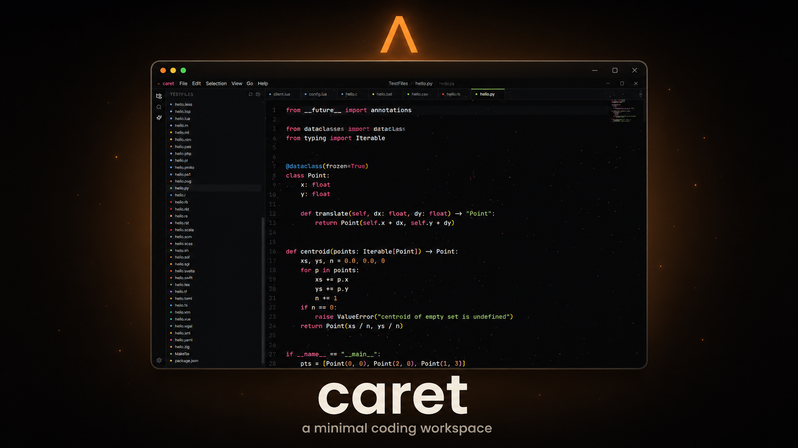

# caret

A minimal, smooth desktop coding workspace. Near-black surfaces, a single soft accent, a Monaco editor that scrolls and breathes, and just enough chrome to get work done.

<p align="center">
  
</p>

## Stack

- Electron + [electron-vite](https://electron-vite.org) for the main / preload / renderer split
- React 18 + TypeScript (strict)
- Monaco Editor via `@monaco-editor/react`
- Tailwind CSS for the surface
- Framer Motion for transitions
- `electron-builder` for packaging

## Features

- Open a folder and browse it in a collapsible sidebar
- Lazy-loaded file tree with rename, delete, and inline new-file / new-folder
- Tabs that slide in and out, with a per-language accent dot and a top-edge bar on the active tab
- **Split editors**: open the same file or different files side by side; close a group to collapse it
- Monaco editor with a custom dark theme, smooth caret and scrolling, syntax + accent colors for ~60 languages (JS/TS, Python, C/C++/C#, Rust, Go, Lua, Java/Kotlin/Scala, Ruby, PHP, Swift, Dart, Haskell, Elixir, F#, Shell/PowerShell, HTML/CSS/SCSS, JSON/YAML/TOML/XML, SQL, Markdown, Dockerfile, GraphQL, Solidity, and more)
- **Minimap** scroll preview on the right edge, slim and only visible while scrolling
- **Code folding** with mouse gutter and chord shortcuts (`Ctrl+K Ctrl+0` fold all, `Ctrl+K Ctrl+J` unfold all)
- **Quick Open** (`Ctrl+P`): fuzzy file search across the workspace
- **Workspace search & replace** (`Ctrl+Shift+F`): full-text search with case / whole-word / regex toggles and replace-all
- **Autosave** on window blur and on tab close, so a stray click never loses your work
- **Language-tinted cursor**: the caret takes the color of the open file's language
- **Image preview** for PNG, JPG, GIF, SVG, WebP, BMP, ICO, AVIF, APNG, TIFF on a checkered transparency-safe canvas
- **Menu bar** in the title bar: File / Edit / Selection / View / Go / Help, all wired to Monaco actions
- **Activity bar** on the left: Explorer / Search / Ambient toggle / Settings
- **Settings panel** (`Ctrl+,`): live-themable accent, background, panel color; editor font size, tab size, word wrap, minimap, line numbers, cursor tint, ambient particles. Preset accent swatches + a custom HSV color picker. Persisted across launches.
- **Ambient particles** background in the editor pane: dense, accent-tinted, repelled by your cursor, with bursts when you type
- Frameless window with custom title bar and working minimize / maximize / close
- Remembers the last opened folder and your settings across launches

## Scripts

```bash
npm install
npm run dev          # launch the IDE in dev mode
npm run typecheck    # tsc --noEmit on both projects
npm run lint
npm run build        # type-check + build
npm run build:win    # produce a Windows .exe in release/
npm run build:mac    # macOS .dmg
npm run build:linux  # Linux AppImage
```

## Project structure

```
src/
├── main/              Electron main process: window, IPC, tiny JSON store
├── preload/           contextBridge: exposes a typed `window.caret` API
├── renderer/
│   ├── components/    TitleBar, MenuBar, ActivityBar, Sidebar, FileTree(...), Tabs, EditorGroupView, EditorPane, ImageViewer, QuickOpen, SearchPanel, SettingsModal, ColorPicker, AmbientBackground, Welcome
│   ├── hooks/         useWorkspace, useFileTree, useFileIndex, useGroups, useSettings, useWindowState, useShortcut, useChord
│   ├── lib/           languages, monaco theme + worker setup, path helpers, fuzzy matcher, color math, editor ref
│   ├── App.tsx
│   └── main.tsx
└── shared/            types shared across processes (TreeNode, CaretApi, SearchHit, ...)
```

## Architecture, briefly

The renderer never touches `node:fs` directly. Everything goes through a single typed `CaretApi` exposed via `contextBridge` in [`src/preload/index.ts`](src/preload/index.ts). The main process handles file I/O, the native folder picker, window controls, workspace search/replace, and a tiny JSON store (`{ lastFolder, settings }`) kept in `app.getPath('userData')`.

The renderer state is split across small hooks: `useWorkspace` owns the open folder, `useFileTree` owns the lazy-loaded tree, `useFileIndex` keeps a flat list for Quick Open, `useGroups` owns editor groups (each with their own tabs and active tab), `useSettings` owns the persisted theme + editor options. Components stay declarative and under ~200 lines apiece.

Monaco is bundled as a real dependency (not loaded from CDN) and wired to Vite workers in [`src/renderer/lib/monaco-setup.ts`](src/renderer/lib/monaco-setup.ts). All theme tokens (including the peek-references widget) follow the live accent / background / panel settings.

## Shortcuts

| Key | Action |
| --- | --- |
| `Ctrl/Cmd + S` | Save the active file |
| `Ctrl/Cmd + P` | Quick Open, fuzzy file search |
| `Ctrl/Cmd + Shift + F` | Search across all workspace files |
| `Ctrl/Cmd + B` | Toggle the sidebar |
| `Ctrl/Cmd + \` | Split editor right |
| `Ctrl/Cmd + W` | Close the active tab (autosaves first) |
| `Ctrl/Cmd + K  Ctrl/Cmd + 0` | Fold all |
| `Ctrl/Cmd + K  Ctrl/Cmd + J` | Unfold all |
| `Ctrl/Cmd + ,` | Open Settings |

## Out of scope

Terminal, extensions, git integration: deliberately left out to keep the surface small. Closing a dirty tab autosaves rather than prompting.

## License

[MIT](./LICENSE)
